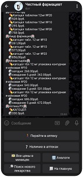

# Telegram bot - Честный фармацевт
## id: @farm_blg_bot
### Описание
Данный бот ориентирован на Аудиторию города Благовещенск (Амурская область). 
Бот умеет производить парсинг данных на сайтах аптек по запросу пользователя и возвращать результаты 
поиска в виде сообщения. Данный бот должен значительно упростить поиск лекарств, а также помочь сэкономить 
на их покупке. Помимо поиска лекарств во всех аптеках города, он может подобрать аналоги искомого лекарства.

Название: Честный фармацевт

### Клавиатуры и элементы управления
* Клавиатура главного меню
  * Кнопка "Инфо"
  * Кнопка "Найти лекарство"
  * Кнопка "Управление рассылкой"
* Клавиатура поиска
  * Кнопка "Все цены лекарства"
  * Кнопка "Минимальная цена во всех аптеках"
  * Кнопка "На главную"
* Клавиатура действий
  * Кнопка "Перейти в аптеку"
  * Кнопка "Наличие в аптеках"
  * Кнопка "Все цены в Миницен"
  * Кнопка "Аналоги"
  * Кнопка "Поиск нового лекарства"
  * Кнопка "На главную"
* Клавиатура аптек
  * Кнопка "Твоя аптека"
  * Кнопка "Миницен"
  * Кнопка "Амур фармация"
  * Кнопка "Монастырёв"
  * Кнопка "АптекаРу"
  * Кнопка "Планета здоровья"
  * Кнопка "Вернуться назад"

  
### Особенности
* Реализован поиск товаров во всех аптеках города используя API или парсинг HTML страниц
* Ведение статистики поисков в базе данных, для дальнейшего анализа, учитываются товары и сколько раз производился поиск по нему
* Поиск аналогов товара
* Просмотр всех цент сети аптек Миницен(цена на товар в разных аптеках одного города различается)

### TODO
* Рассылка пользователям (акции аптек)
* Кнопка "Получить обновления"
* В перспективе можно сделать для всех городов.

### Структура файлов

      |─ main.py - программный код приложения (входная точка)
      |─ create_bot.py - программный код для запуска бота в онлайн
      |─ DB - папка содержащая базу данных и запросы к ней
        └─ add_request.py - запросы к БД
        └─ farmBLG.sqlite - файл БД
      |─ data - папка с графическими файлами
        └─ bot_run.bat - батник для запуска бота на сервере
        └─ TOKEN.json - токен для подключения к боту
      |─ handlers - папка с обработчиками запрсов пользователя
      |─ keyboards - папка с отображаемыми клавиатурами в чате бота
      |─ parsers - папка с алгоритмами получения товаров из аптек
      |─ images - папка с графическими файлами

### Требования к запуску
Все требования в requirements.txt
P.S. бот находится на сервере, не нужно его запускать локально

# *Работа с ботом*

### Предупреждения:
* Поиск аналогов лекарств производит сторонний ресурс, бот не является врачом, перед покупкой аналога, проконсультируйтесь с врачом;
* В разных аптеках сети «Миницен» на одно и тоже лекарство цена может отличаться;
* Поиск лекарств в сети «Миницен» производится по адресу Зейская, 182, поскольку данный филиал является самым крупным в городе;
* Цены актуальны только при заказе онлайн;
### Правила поиска:\n"
* Шаг 1: в главном меню выбрать пункт «Найти лекарство»

* Шаг 2: выбрать «Все цены лекарства» в случае, если вам необходимо посмотреть все совпадения по вашему поиску или «Минимальная цена во всех аптеках», если хотите найти минимальную цену искомого лекарства (подходит для более точного поиска с указанием дополнительных атрибутов, например: тбл, в/в, 25мг)

* Шаг 3: после выбора условий поиска, необходимо с помощью отобразившийся клавиатуры написать название и при необходимости нужные атрибуты искомого лекарства. Поиск займёт некоторое время, после чего бот выведет результаты поиска и отобразит меню действий.
* Шаг 4: действия после поиска:

  * если необходимо посмотреть наличие лекарства в определённой аптеке, нужно выбрать пункт меню «Наличие в аптеках», после чего выбрать нужную аптеку (работает только при поиске минимальных цен в аптеках).
  * В разных филиалах сети аптек «Миниецен», разные цены на одни и те же лекарства, для того чтобы отобразить цены во всех филиалах, используйте кнопку «Все цены в миницен»
  * Чтобы бот подобрал вам аналоги лекарства, воспользуйтесь пунктом меню «Аналоги»
  * Для того чтобы перейти в одну из аптек, выберите «перейти в аптеку», бот отправит сообщение с кнопками для перехода в аптеки.
  * Для поиска нового лекарства нажмите на кнопку «Поиск нового лекарства», далее см. Шаг 2.
  * После завершения поиска выберите пункт меню «На главную».

